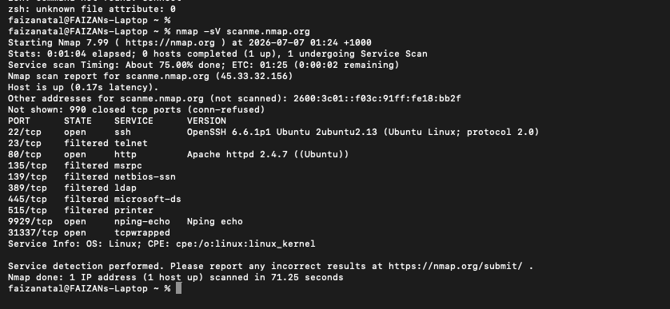

# Lab: Network Scanning with Nmap

**Platform:** Nmap (installed locally via Homebrew)
**Date:** July 2026

## Task
Practice using Nmap to scan a target host and identify open ports, running services, and service versions.

## What I did
Installed Nmap locally on macOS via Homebrew, then ran a service-detection scan (`nmap -sV`) against `scanme.nmap.org`, a host maintained by the Nmap team specifically for public scanning practice. The scan identified open ports including SSH (22), HTTP (80), and Nping Echo (9929), along with the specific service versions running on each (e.g. OpenSSH 6.6.1p1, Apache httpd 2.4.7) and the target's operating system.

## Key learning
Learned how a single Nmap scan can reveal a host's attack surface — which services are exposed, what software versions they're running, and which ports are filtered versus open. Understanding this is foundational to identifying vulnerabilities during a security assessment, since outdated service versions are often the starting point for known exploits.

