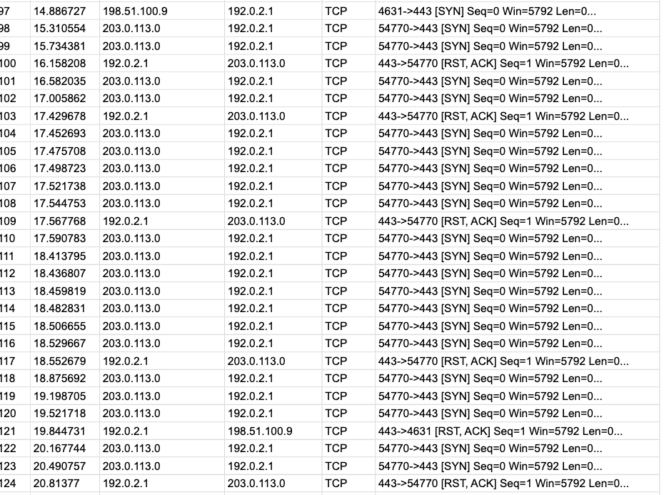

# Lab: Incident Analysis — SYN Flood Attack (DoS)

**Platform:** Google Cybersecurity Professional Certificate (case study)
**Date:** August 2026

## Scenario
A travel agency's web server became unreachable, returning connection timeout 
errors to employees and customers trying to reach the sales page. An automated 
monitoring alert flagged the problem, and a packet capture was reviewed to 
investigate.

## Analysis
Reviewing the Wireshark TCP log showed a clear contrast between legitimate and 
malicious traffic. Normal users (e.g. 198.51.100.23, 198.51.100.14) completed 
the full three-way handshake — SYN, SYN-ACK, ACK — before sending a GET request 
and receiving a 200 OK response.

One source, 203.0.113.0, behaved differently: it repeatedly sent SYN packets to 
port 443 from the same source port (54770), received the server's SYN-ACK, but 
never sent the final ACK to complete the handshake. Instead, it immediately sent 
another SYN. This repeated for hundreds of packets over roughly 50 seconds, 
never once completing a handshake or sending an HTTP request. The server can be 
seen periodically responding with RST, ACK (connection reset) packets in an 
attempt to reject the stalled connections, but the attacker simply issued new 
SYN packets immediately after each reset, keeping the flood going.

The impact was visible directly in the logs: a legitimate user (198.51.100.5) 
received a 504 Gateway Timeout instead of a normal response, confirming the 
server's connection resources were being exhausted by the flood of incomplete, 
"half-open" connections.

This matches the signature of a **SYN flood attack**, a form of Denial-of-Service 
(DoS) attack that abuses the TCP three-way handshake:
1. Client sends SYN
2. Server responds SYN-ACK and reserves resources, awaiting the final ACK
3. Client normally completes with ACK — but in a SYN flood, this step never happens

Because the server holds each half-open connection in memory while waiting for 
an ACK that never arrives, a high enough volume of SYN packets exhausts its 
capacity to accept new, legitimate connections.

## Response actions
- Took the affected server offline temporarily to allow it to recover
- Blocked the offending IP (203.0.113.0) at the firewall as an immediate mitigation
- Flagged that IP blocking alone is a short-term fix, since attackers can spoof 
  source IPs to bypass a single block, and escalated to recommend longer-term 
  mitigations (e.g. SYN cookies, rate limiting, DDoS

## Evidence
Excerpt from the Wireshark TCP log showing the repeated SYN pattern from 
203.0.113.0 and the server's RST, ACK responses:

